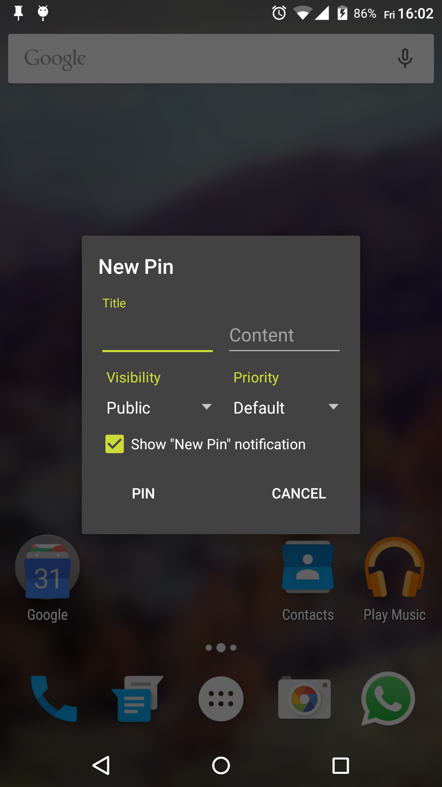
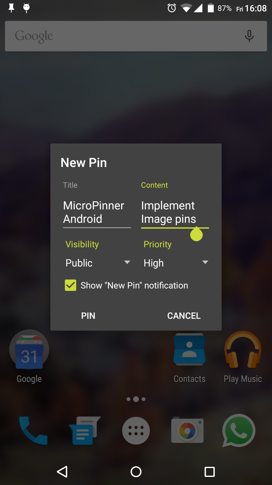
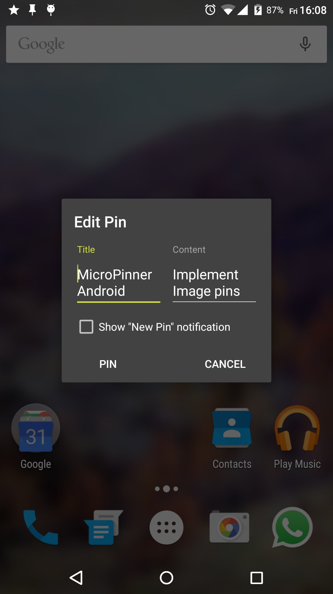

#  MicroPinner

MicroPinner is a lightweight dialog-only application, which lets you pin text to your statusbar.
 You can also customize the pins priority and visibility (Android 5.+ only).

## Features

+ **Material Design aligned**  
    Design follows the Material Design Dialog guidelines.
+ **Lightweight**  
    Weights deodexed less than a single megabyte.
+ **Zero battery & memory impact**  
    It won't drain your battery nor your memory. No background-services, no background-processes. Incase it does, your SystemUI is a b**ch.
+ **Permission free** (almost)
    It will neither spy on your SMS's, nor call it's mothership over network. It just want to know when your devices finished its boot-procress, to restore your pins.
+ **Open source**
    The complete source-code is available here on Github.
+ **Backwards compatible**  
    Works on Android 4.1 and up. Lower than 4.1 breaks priority feature.
+ **Choosable priority**  
    Give your pin the priority you think it deserves.
+ **Editable pins**  
    Edit your pins easily by clicking on them.

#### Android 5.+ only

+ **Choosable visibility**  
    Hide your pin on the lockscreen by using Android 5's visibility-API: Choose between *public*, *private* and *secret*.

## Screenshots

&nbsp;
&nbsp;

## Changelog

1. Version: v1.0 (Initial release)
    - date: 11th June 2015
    - sha1 checksum: *ce67e91f42bca5d9d927f73c7d423071f887ad59*
    - download: [Github](https://github.com/dotWee/MicroPinner/releases/download/release-v1.0/release_v1.0.apk)

2. Version: v1.1 (Disallow empty titles and let user decide if he wants to see the "new pin"-notification)
    - date: 12th June 2015
    - sha1 checksum: *3003cedb937a73f943e618c9f7cd3e82bc468e20*
    - download: [Github](https://github.com/dotWee/MicroPinner/releases/download/release-v1.1/release_v1.1.apk)

3. Version: v1.2 (Fix non-working visibility & priority)
    - date: 12th June 2015
    - sha1 checksum: *a01095619f18e4d9f6b35065125e907f64246948*
    - download: [Github](https://github.com/dotWee/MicroPinner/releases/download/release-v1.2/release_v1.2.apk);

4. Version: v1.3 (Reworked layout | German translation | new MIN-priority | Allow persistent pins)
    - date: *upcoming*
    - sha1 checksum:
    - download:

## Build

This project is developed using JetBrain's IntelliJ IDEA 14.1 and the latest Gradle-wrapper.

To build MicroPinner, simply import this project into Android Studio or IntelliJ IDEA.

## Todo

+ Choosable notification color (sdk21+ only)
+ Choosable notification-category
+ Allow persistent pins
+ Implement image-pins
+ Choosable icon
+ Hide pin-icon

## License

Copyright (c) 2015 Lukas 'dotwee' Wolfsteiner
The source-code of MicroPinner is licensed under the [_Do What The Fuck You Want To_](/LICENSE.md) public license.
