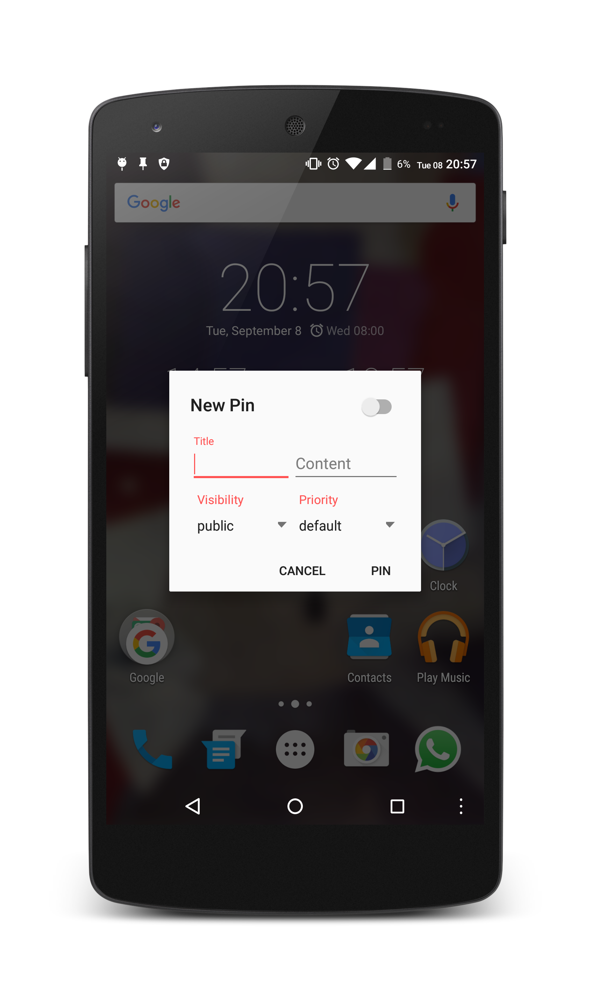
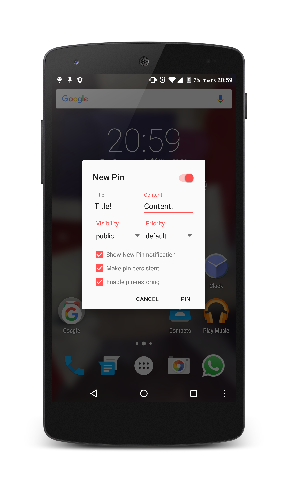

#  MicroPinner

MicroPinner is a lightweight dialog-only application, that turns your statusbar into a pingboard, almost same as sticky notes on your PC. (You can basically create your own notifications or  noted  reminders)
You can customize the notifications title and content, as well as its priority and visibility (Works on Android 5.0 and above).

## Features

<b>The application currently has the following features</b>

+ low background memory consumption(no background-services, no background-processes)
+ has no impact on your battery as it uses only native functions of Android
+ now works flawlessly on Android Oreo 8.0+
+ it is  light weight less than 850kb (Version v2.2.0)
+ it contains no ads or unnecessary pop-ups
+ it is fully open source!
+ it is absolutely free!

<b>Design & UI</b>

+ MicroPinner follows the official [Material Design](https://www.google.com/design/spec/components/dialogs.html#dialogs-specs) guidelines for dialogs.

<b>Customization</b>

+ You can customize the notifications title and content text, as well as its system wide priority (choose between *normal*, *minimal*, *low* and *high*) and visibility (choose between *public*, *private* and *secret*) if you're running Android Lollipop and up.
+ Created pins are restored on reboot. Delete them by simply swiping it away. 

## Screenshots

&nbsp;
&nbsp;

## Changelog

View the [CHANGELOG.md](/docs/CHANGELOG.md).

## Questions / Issues / Bugs

Please check the [FAQ](/docs/FAQ.md) first.
For questions or bugs, check the [Issues](https://github.com/dotWee/MicroPinner/issues)-section of this repository.

## Build

This project is developed using JetBrain's latest IntelliJ IDEA and the latest Gradle-wrapper.

To compile MicroPinner, simply import this project into **Android Studio** or **IntelliJ IDEA** and press the build-button.
**You may need to sign the built apk.** Read the official [documentation about signing applications](https://developer.android.com/tools/publishing/app-signing.html) for a how-to.

## License

Copyright (c) 2015 Lukas 'dotwee' Wolfsteiner
The source-code of MicroPinner is licensed under the [_Do What The Fuck You Want To_](/LICENSE.md) public license.

