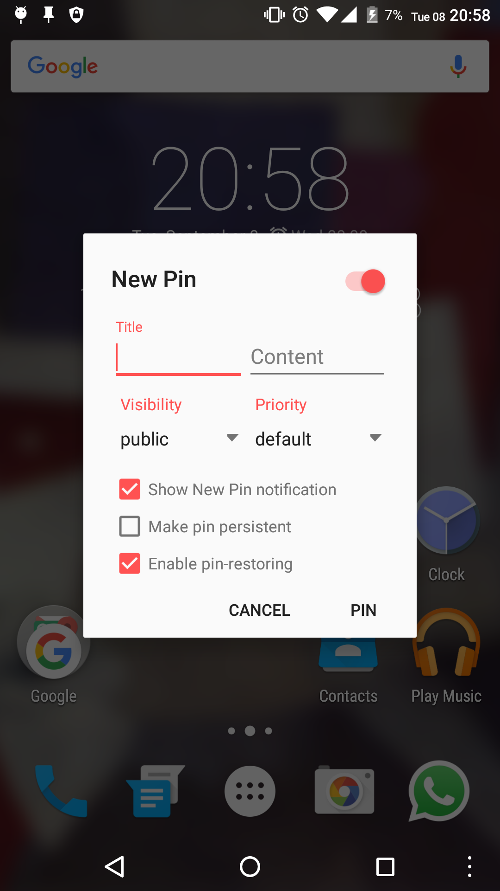
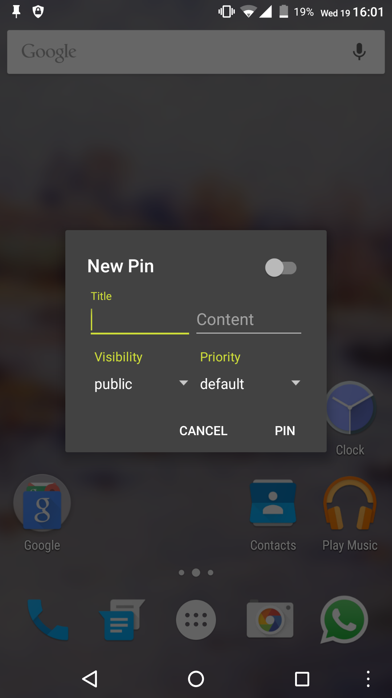
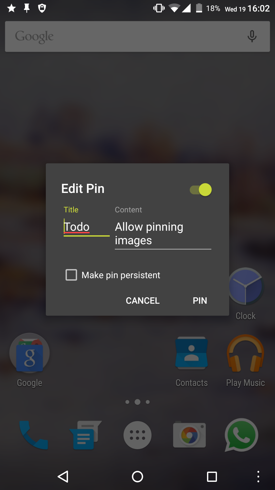

#  MicroPinner

MicroPinner is a lightweight dialog-only application, that turns your statusbar into a pingboard. (You can basically create your own notifications)
You can also customize the notifications title and content, as well as its priority and visibility (Android 5 or greater only).

## Features

<b>The application itself</b>
+ consumes no memory in the background - background-services, no background-processes 
+ has no impact on your battery - it uses only native functions of Android
+ is compatible down to Android Jelly Bean
+ weights less than 700kb (Version v1.8)
+ is fully open source!  

<b>Design & UI</b>
MicroPinner follows the official [Material Design](https://www.google.com/design/spec/components/dialogs.html#dialogs-specs) specs for dialogs.

<b>Customization</b>
You can customize the notifications title and content text as well as its system wide priority (choose between *normal*, *minimal*, *low* and *high*) and visibility (choose between *public*, *private* and *secret*) if you're running Android Lollipop and up. 
Created pins are restored on reboot. Delete them by simply swiping it away. 

## Screenshots

&nbsp;
&nbsp;

&nbsp;
&nbsp;

&nbsp;
&nbsp;

## Changelog

View the [CHANGELOG.md](/docs/CHANGELOG.md).

## Questions / Issues / Bugs

Please check the [FAQ](/docs/FAQ.md) first.
For questions or bugs, check the [Issues](https://github.com/dotWee/MicroPinner/issues)-section of this repository.

## Build

This project is developed using JetBrain's latest IntelliJ IDEA and the latest Gradle-wrapper.

To compile MicroPinner, simply import this project into **Android Studio** or **IntelliJ IDEA** and press the build-button.
**You may need to sign the built apk.** Read the official [documentation about signing applications](https://developer.android.com/tools/publishing/app-signing.html) for a how-to.

## License

Copyright (c) 2015 Lukas 'dotwee' Wolfsteiner
The source-code of MicroPinner is licensed under the [_Do What The Fuck You Want To_](/LICENSE.md) public license.
