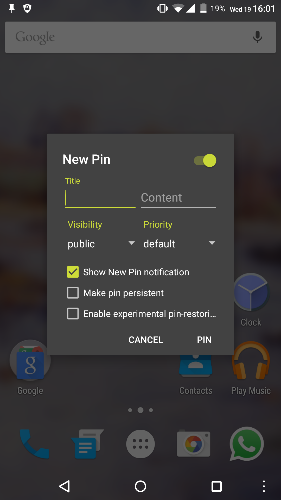
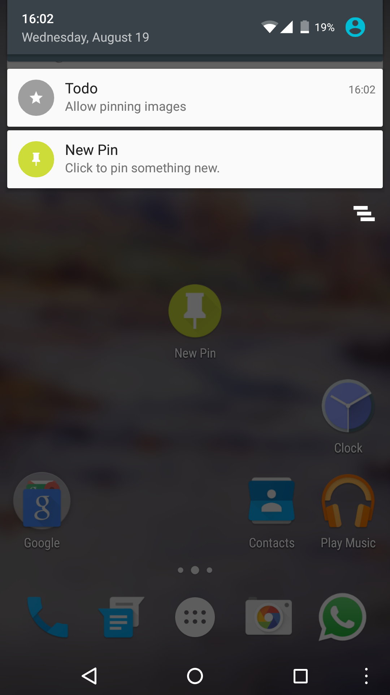
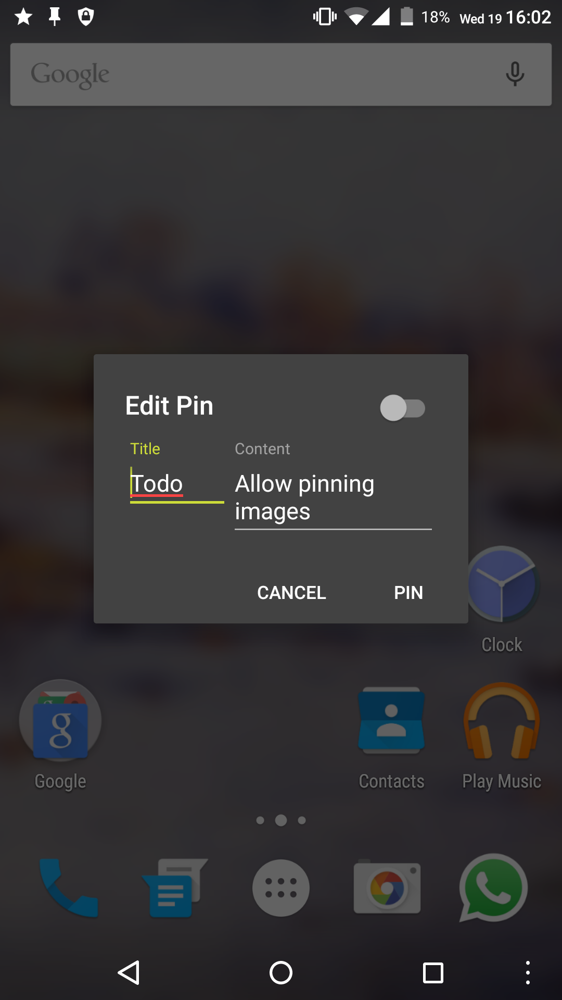

#  MicroPinner

MicroPinner is a lightweight dialog-only application, which lets you create your own notifications.
 You can also customize the notifications title and content, as well as its priority and visibility (Android 5.+ only).

## Features

+ **Material Design aligned**
     Design follows the [Material Design Dialog](https://www.google.com/design/spec/components/dialogs.html#dialogs-specs) guidelines.
+ **Lightweight**
     Weights deodexed less than 750kb.
+ **Zero battery & memory impact**
     It won't drain your battery nor your memory. No background-services, no background-processes. Incase it does, tell your SystemUI she's a b**ch.
+ **Backwards compatible**
     Works on Android 4.1 and up. Lower than 4.1 breaks priority feature.
+ **Permission free**
     It will neither spy on your SMS's, nor call it's mothership over network.
     It just want to know when your devices finished its boot-procress, to restore your pins.
+ **Open source**
     The whole source-code is available here on Github.
+ **Restore functions**
     Pins are saved until you swipe them away.
     To restore your pins for example after a reboot, simply open the dialog.
+ **Permanent pins**
     Declare your pins as permenent and delete them by clicking on them.
+ **Choosable priority**
     Give your pin the priority you think it deserves.
+ **Editable pins**
     Edit your pins easily by clicking on them.

#### Android 5.+ only

+ **Choosable visibility**
     Hide your pin on the lockscreen by using Android 5's visibility-API: Choose between *public*, *private* and *secret*.

## Screenshots

&nbsp;
&nbsp;

&nbsp;
&nbsp;

## Changelog

View the [CHANGELOG.md](/docs/CHANGELOG.md).

## Questions / Issues / Bugs

Please check the [FAQ](/docs/FAQ.md) first.

## Build

This project is developed using JetBrain's latest IntelliJ IDEA and the latest Gradle-wrapper.
To compile MicroPinner, simply import this project into Android Studio or IntelliJ IDEA and press the build-button.
You may need to sign the built apk. Read the official [documentation about signing applications](https://developer.android.com/tools/publishing/app-signing.html) for a how-to.

## Todo

+ <del>Choosable icon</del> Won't be included. To much data-bloat, I want to keep this app as slim as possible.
+ <del>Create a FAQ</del> Read it ([here](/docs/FAQ.md).
+ Choosable notification-category
+ Choosable notification color
+ <del>Allow hiding the pin-icon</del> Available since v1.4 - simply set the priority to 'min'.
+ <del>Allow persistent pins</del> Implemented in v1.4 - use the persistent-checkbox.
+ <del>Implement min-priority</del> Also implemented in Version v1.4.
+ (Code) Documentation
+ Single-line pin (in progress but i need some help, check issue #2)

## License

Copyright (c) 2015 Lukas 'dotwee' Wolfsteiner
The source-code of MicroPinner is licensed under the [_Do What The Fuck You Want To_](/LICENSE.md) public license.
